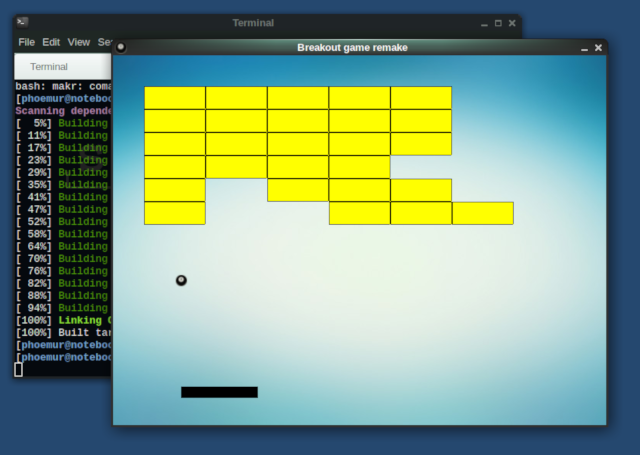

# breakout
Breakout / arkanoid remake made with C++14 and SDL2

Just an exercise to implement the observer design pattern

# Requirements
  - C++14
  
  - SDL2
  
  - SDL2_image
  
  - SDL2_ttf
  
  - SDL2_mixer
  
# Build and Run
    git clone https://github.com/phoemur/breakout.git
    cd breakout
    mkdir -p build
    cd build
    cmake ..
    make
    cd ..
    ./breakout

